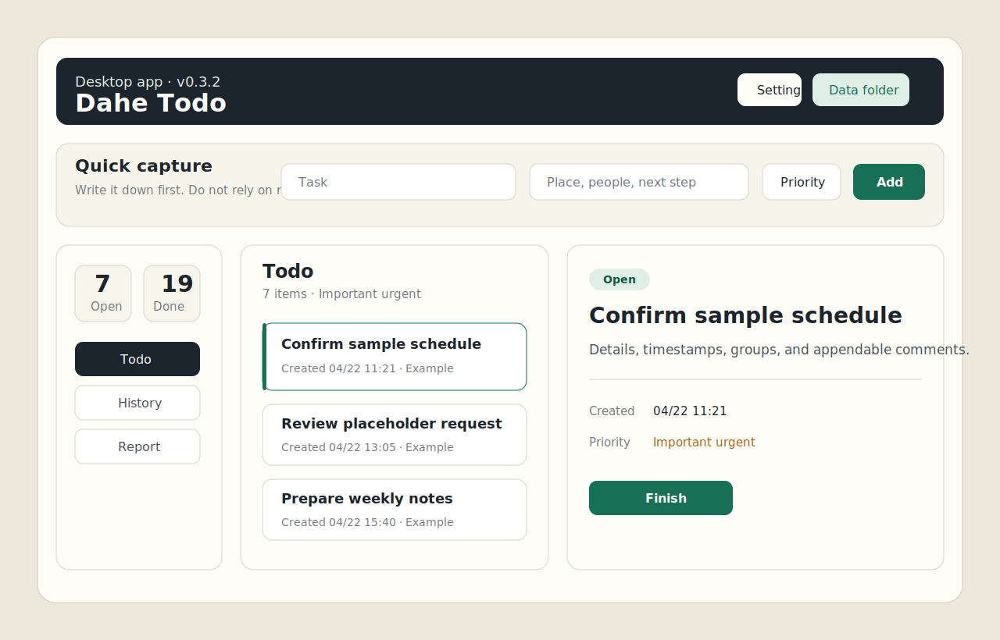

# Dahe Todo

[简体中文](README.md) · **English**

A local-first Windows todo app for interruption-heavy work: quick capture, completion comments, priority quadrants, history review, and weekly-report material collection.



Website: [https://hyv5478.github.io/dahe-todo/](https://hyv5478.github.io/dahe-todo/)

## Features

- Capture sudden tasks quickly without breaking your current workflow.
- Add multiple comments after completion to record results, causes, impact, and follow-up notes.
- Use four priority quadrants: important urgent, important not urgent, not important urgent, not important not urgent.
- Filter active tasks by priority and review completed work by time range.
- Collect completed tasks and comments for weekly reports.
- Store data locally as JSON by default.
- Configure the desktop app name and local data directory.

## Current Version

- Desktop version: `v0.3.2-priority-quadrants`
- Windows installer is available from GitHub Releases.

## Desktop Development

Install dependencies:

```powershell
cd desktop
npm.cmd install --cache .npm-cache
```

Start the desktop app:

```powershell
cd desktop
npm.cmd start
```

Run checks:

```powershell
cd desktop
npm.cmd run check
```

Build the Windows installer:

```powershell
cd desktop
npm.cmd run dist
```

Installer output:

```text
desktop/release/大何的待办事项 Setup 0.3.2.exe
```

## Local Data

Default desktop data file:

```text
%USERPROFILE%\Documents\DaheTodo\tasks.json
```

The data directory can be changed inside the app. This repository includes a privacy check and pre-push hook to prevent local task data, installers, dependency caches, and tool directories from being committed.

## Web Version

The legacy local browser version is still available:

```powershell
start-todo.bat
```

Its data is stored at `data/tasks.json`, which is ignored by Git.

## Website

GitHub Pages is served from:

```text
docs/
```

Chinese page:

```text
docs/index.html
```

English page:

```text
docs/en.html
```

## Privacy

Dahe Todo does not require an account, does not connect to a knowledge base, and does not upload todo content by default. See [PRIVACY.md](PRIVACY.md).

## License

MIT
