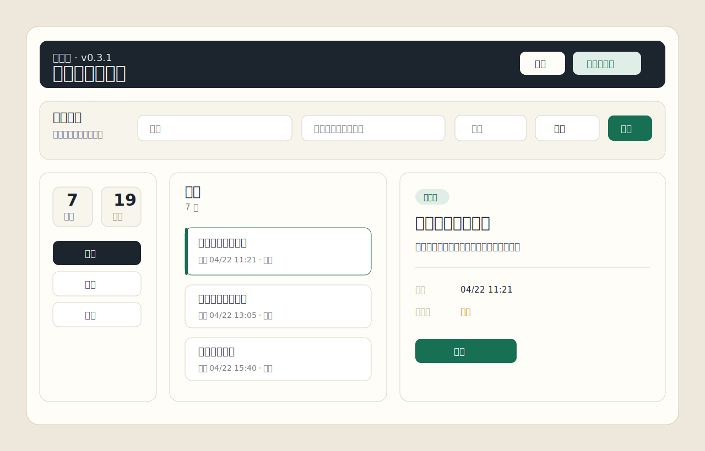

# 大何的待办事项

**简体中文** · [English](README.en.md)

本地优先的 Windows 待办工具，适合大量琐碎事项、临时插入任务、专注番茄、完成评论和周报素材整理。

[官网预览](https://hyv5478.github.io/dahe-todo/) · [GitHub Releases](https://github.com/hyv5478/dahe-todo/releases/latest)



## 当前版本

- 桌面端版本：`v0.5.0-achievements`
- Windows 安装包：`大何的待办事项 Setup 0.5.0.exe`
- 存储方式：本地 JSON 文件，默认不联网、不上传、不需要账号

## 功能分区

### 捕获

- 快速记录突然插入的事项，降低打断当前工作的成本。
- 支持标题、补充说明、分组和优先级。
- 支持四象限优先级：重要紧急、重要不紧急、不重要紧急、不重要不紧急。

### 执行

- 待办页支持按优先级筛选。
- 可给当前任务开启番茄钟，记录完整番茄、中断原因和累计专注时间。
- 因“其他”原因中断时，可以生成一条新的重要紧急待办。

### 沉淀

- 完成事项后可以追加多条评论，记录过程、结果、原因和影响。
- 保留创建时间、办理时间、分组、优先级、番茄记录和中断记录。

### 复盘

- 历史页支持按周或按月回看。
- 周报页汇总完成事项、评论、专注时长、中断次数和本期成就。
- v0.5.0 增加每周成就系统，把专注和闭环变成可见反馈。

## 本地数据

桌面端默认数据目录：

```text
%USERPROFILE%\Documents\DaheTodo
```

核心数据文件：

```text
tasks.json
focus-sessions.json
achievements.json
```

仓库已加入隐私检查和 pre-push 钩子，避免把本地任务数据、番茄记录、成就记录、安装包、依赖缓存和工具目录提交到 GitHub。

## 桌面端开发

```powershell
cd desktop
npm.cmd install --cache .npm-cache
npm.cmd run check
npm.cmd run dist
```

安装包输出：

```text
desktop/release/大何的待办事项 Setup 0.5.0.exe
```

## 发布主页

GitHub Pages 使用：

```text
docs/
```

中文页：`docs/index.html`

英文页：`docs/en.html`

## 隐私

本项目默认不需要账号、不连接知识库、不上传待办内容。更多说明见 [PRIVACY.md](PRIVACY.md)。

## License

MIT
